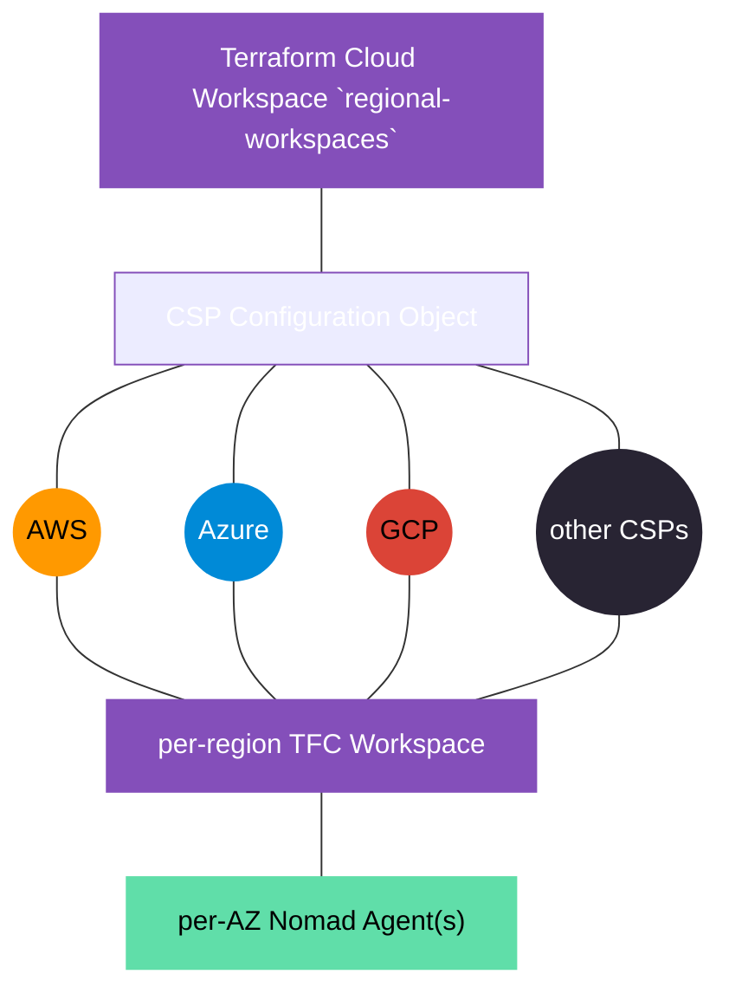

# Terraform Cloud Workspace `regional-workspaces`

> This directory manages Regional (and provider-specific) Terraform Cloud Workspaces for [@workloads](https://github.com/workloads).

## Table of Contents

<!-- TOC -->
* [Terraform Cloud Workspace `regional-workspaces`](#terraform-cloud-workspace-regional-workspaces)
  * [Table of Contents](#table-of-contents)
  * [Requirements](#requirements)
  * [Diagrams](#diagrams)
    * [Terraform Cloud Workspace Structure](#terraform-cloud-workspace-structure)
  * [Usage](#usage)
    * [Inputs](#inputs)
    * [Outputs](#outputs)
  * [Notes](#notes)
    * [Updating Azure Regions File](#updating-azure-regions-file)
  * [Author Information](#author-information)
  * [License](#license)
<!-- TOC -->

## Requirements

* Terraform Cloud [Account](https://app.terraform.io/session)
* Terraform `1.5.0` or [newer](https://developer.hashicorp.com/terraform/downloads).

## Diagrams

This section contains an overview of (simplified) diagrams, describing the logical connections of the individual Terraform Cloud Workspaces.
All diagrams are expressed in [Mermaid](https://mermaid.js.org) syntax.

### Terraform Cloud Workspace Structure

This diagram describes the [Terraform Cloud Workspaces](https://developer.hashicorp.com/terraform/cloud-docs/workspaces) structure:



## Usage

The `regional-workspaces` Terraform Cloud Workspace acts as a bootstrapper for CSP-specific and regional Terraform Cloud Workspaces.

This repository uses a standard Terraform workflow (`init`, `plan`, `apply`).

For more information, including detailed usage guidelines, see the [Terraform documentation](https://developer.hashicorp.com/terraform/cli/commands).

Additional workflows are available through a [Makefile](./Makefile).

Running `make` without commands will print out the following help information:

```text
🌐 REGIONAL TERRAFORM CLOUD WORKSPACES

Target                        Description                                                  Usage
get-az-subscription           get Azure Subscription to currently logged-in Account        `make get-az-subscription`
set-az-subscription           set Azure CLI Subscription to currently logged-in Account    `make set-az-subscription`
create-az-service-principal   create Azure Service Principal                               `make create-az-service-principal`
list-az-locations             retrieve and format a list of available Azure Locations      `make list-az-locations update_file=true`
help                          display a list of Make Targets                               `make help`
_listincludes                 list all included Makefiles and *.mk files                   `make _listincludes`
_selfcheck                    lint Makefile                                                `make _selfcheck`
```

<!-- BEGIN_TF_DOCS -->
### Inputs

| Name | Description | Type | Required |
|------|-------------|------|:--------:|
| csp_configuration | Project-wide List of Cloud Service Providers (CSPs). | <pre>list(object({<br>    name    = string<br>    prefix  = string<br>    enabled = bool<br>  }))</pre> | yes |
| google_credentials | The credentials to use for authenticating with GCP. | `string` | yes |
| google_project_id | The Project ID to use for authenticating with GCP. | `string` | yes |
| management_region_aws | AWS-specific `Management` Region Identifier. | `string` | yes |
| management_region_google | Google-specific `Management` Region Identifier. | `string` | yes |
| terraform_version | Version of Terraform to use for Terraform Cloud. | `string` | yes |
| tfe_oauth_client_id | VCS Provider OAuth Client Identifier. | `string` | yes |
| tfe_organization | Name of the Terraform Cloud Organization. | `string` | yes |

### Outputs

| Name | Description |
|------|-------------|
| aws_workspace_urls | AWS-specific Regional Workspace URLs. |
| azure_workspace_urls | Azure-specific Regional Workspace URLs. |
| csp_configuration | Exported value of `local.csp_configuration`. |
| google_workspace_urls | Google Cloud-specific Regional Workspace URLs. |
<!-- END_TF_DOCS -->

## Notes

### Updating Azure Regions File

The Azure Regions file ([`./variables_azure_locations.json`](./variables_azure_locations.json)) can be updated by executing the `list-az-locations` target while setting the `update_file` flag to `true`:

```shell
make list-az-locations update_file=true
```

## Author Information

This repository is maintained by the contributors listed on [GitHub](https://github.com/workloads/regional-workspaces/graphs/contributors).

## License

Licensed under the Apache License, Version 2.0 (the "License").

You may obtain a copy of the License at [apache.org/licenses/LICENSE-2.0](http://www.apache.org/licenses/LICENSE-2.0).

Unless required by applicable law or agreed to in writing, software distributed under the License is distributed on an _"AS IS"_ basis, without WARRANTIES or conditions of any kind, either express or implied.

See the License for the specific language governing permissions and limitations under the License.
